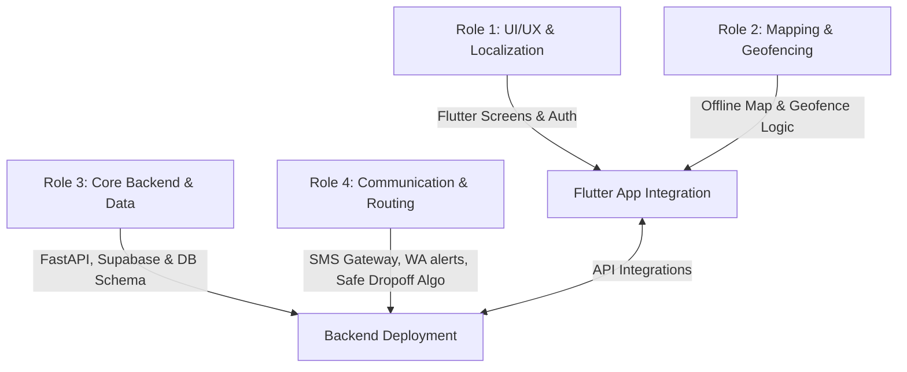

# CivicPulse

An action-oriented technical architecture, free-tier toolstack, and 24-hour execution roadmap for a team of 4 to deliver a functional MVP addressing infrastructure, healthcare, and gender-based violence (GBV) issues.

---

## Getting Started

### Prerequisites

- [Flutter SDK](https://flutter.dev/docs/get-started/install) (stable channel, v3.x+)
- [Dart SDK](https://dart.dev/get-dart) (included with Flutter)
- A modern web browser (Chrome or Edge recommended)

### Running the App

#### Web (Recommended for quick preview)

```bash
# 1. Install dependencies
flutter pub get

# 2. Run in debug mode (hot reload enabled)
flutter run -d chrome

# 3. Or run as a local web server on port 9090
flutter run -d web-server --web-port 9090 --web-hostname 127.0.0.1
# Then open http://127.0.0.1:9090 in your browser

# 4. Run in release mode (optimised, faster load)
flutter run -d web-server --release --web-port 9090 --web-hostname 127.0.0.1 --no-web-resources-cdn
```

#### Mobile (Android / iOS)

```bash
# List available devices
flutter devices

# Run on a connected device or emulator
flutter run -d <device-id>
```

#### Backend (FastAPI)

```bash
# Navigate to the backend directory
cd backend

# Create a virtual environment and install dependencies
python -m venv venv
venv\Scripts\activate          # Windows
# source venv/bin/activate     # macOS / Linux

pip install -r requirements.txt

# Start the API server
uvicorn main:app --reload --port 8000
# API docs available at http://127.0.0.1:8000/docs
```

---

## Technical Stack (100% Free Tiers)

To ensure delivery within 24 hours with zero upfront costs, we leverage reliable free-tier services and open-source libraries.

| Layer | Technology | Service / Provider | Free Tier Details | Key Role in Project |
| :--- | :--- | :--- | :--- | :--- |
| **Frontend** | **Flutter** | Cross-platform Framework | Open Source | Android/iOS client app with offline capabilities. |
| **Backend** | **FastAPI** | Python Web Framework | Hosted on **Render** or **Koyeb** | Fast, auto-documenting API endpoints for business logic, queuing, and routing. |
| **Database** | **Supabase** | Backend-as-a-Service (Postgres) | 2 free projects, 500MB DB, WebSockets | Stores user profiles, reports, and handles **Realtime** sync for the live healthcare queue. |
| **Offline Maps** | **flutter_map** + OSM | OpenStreetMap | Open Source (No keys) | Renders map layers offline using local vector/raster tiles and cache database. |
| **SMS/WA Gateway**| **Twilio** / **Africa's Talking** | Communication APIs | Free trial credits ($15+ value) | Handles SMS check-ups, queue notifications, and emergency GBV WhatsApp alerts. |
| **E-hailing / Routing**| **OSRM** / Mapbox | Mapbox Directions API | 100,000 free search/directions requests/mo | Renders safe path calculations and routes walking groups. |
| **Hosting (Backend)**| **Render** or **Koyeb** | App hosting platform | Free tier (webservice spinner sleep, Koyeb has 1 free nanoinstance) | Hosts the Python FastAPI server. |

---

## 4-Person Team Roles & Division

With a 24-hour deadline, roles are highly specialized and run in parallel:



### Role 1: Frontend Developer (UI/UX & Localization)
*   **Focus**: User interface, onboarding, inputs, forms, and translations.
*   **Tasks**:
    1. Set up the Flutter project directory structure (using `easy_localization` or `flutter_localizations` for multi-language support).
    2. Build the **Healthcare Screen**: Patient Intake Form (symptoms slider, pain level, history input), live queue visualization board.
    3. Build the **GBV & Safe Walk Screen**: Safe walking group list, button to initiate e-hailing tracking, request drop-off dashboard.
    4. Handle State Management (e.g., `Provider` or `Bloc` for simple data flow).

### Role 2: Fullstack Mapping & Geofencing Developer
*   **Focus**: Spatial data integration on the mobile client.
*   **Tasks**:
    1. Integrate `flutter_map` with `flutter_map_cache` or pre-downloaded `.mbtiles` for the offline maps requirement.
    2. Set up background location services using `geolocator` and `flutter_background_service`.
    3. Build the local geofencing engine (alerting when approaching stored pothole/traffic light coordinates).
    4. Implement on-device camera capturing for pothole/traffic light reporting (optional animal classification via a simple local script or just instant manual reporting to hit the 24h goal).

### Role 3: Backend Engineer (FastAPI & Database Schema)
*   **Focus**: PostgreSQL database architecture, schema migrations, and REST APIs.
*   **Tasks**:
    1. Spin up a free **Supabase** instance; define tables for `users`, `reports` (potholes, lights, animals), `queues` (healthcare), and `walk_groups`.
    2. Build FastAPI models and router endpoints for:
        *   Creating and retrieving infrastructure reports.
        *   Creating, updating, and fetching healthcare queue states.
    3. Implement Supabase Realtime listener trigger, allowing the Flutter app to receive immediate updates when queue positions change.
    4. Host the API on Render or Koyeb.

### Role 4: System Integration & Algorithmic Developer
*   **Focus**: Third-party APIs, messaging channels, and logic optimization.
*   **Tasks**:
    1. Connect **Twilio** or **Africa's Talking** for SMS services (e.g., listening for incoming patient ID numbers via webhook, parsing them, and replying with their ticket and estimated wait time).
    2. Write the **Group Drop-off Optimizer**:
        *   FastAPI endpoint that accepts a list of coordinate drop-off points, clusters nearby locations, and sorts them by area volume (least populated area dropped off first to ensure group safety).
    3. Write emergency communication triggers: Automatically send background SMS/WhatsApp notifications to designated guardians when an e-hail starts, and on drop-off.
    4. Set up CI/CD or deployment configurations (Dockerfile, environment variables).

---

## Feature Implementation Strategies (24-Hour Scope)

To ensure everything runs reliably and stays within the 24-hour limit, use these streamlined implementations:

### 1. Potholes & Non-functional Traffic Lights
*   **Offline Maps**:
    *   Pre-package a small offline database (`.mbtiles`) of the local area or use `flutter_map_tile_caching` to cache maps when online.
*   **Local Geofencing Alert**:
    *   On start, download nearby pothole coordinates and keep them in a local sqlite database (`drift` package) or in memory.
    *   Use the device's GPS to monitor distance; when within 100 meters of a coordinate, trigger a local push notification: *"Warning: Pothole / Faulty Traffic Light ahead!"*
*   **Animal Crossing**:
    *   A simple button "Report Animal on Road" that captures the current GPS coordinate. 
    *   Alerts next drivers using the same geofencing system.

### 2. Healthcare Check-up and Live Queue Board
*   **SMS Check-up**:
    *   Configure a Twilio/Africa's Talking incoming webhook pointing to FastAPI (`/sms/incoming`).
    *   User sends: `ID: 991231XXXXXXX`.
    *   FastAPI parses ID, looks up/registers the patient, flags urgency (triage level), and replies with: *"Check-up registered! You are number 5 in the Queue. Estimated wait: 45 mins."*
*   **Live Queue Board & Triage**:
    *   Flutter UI connects to Supabase Realtime. When a doctor changes a patient's triage status (Critical, Urgent, Routine) or marks a patient as checked in, the queue board updates instantly on the waiting room screen.

### 3. Gender-Based Violence (GBV) Safety
*   **E-Hailing Alerts**:
    *   When a user clicks "Book Ride Tracking", the app requests the destination.
    *   The app fires an API call to FastAPI, which immediately triggers Twilio to send SMS/WhatsApp alerts to the user's saved emergency contacts: *"Jane has started a ride to [Destination]. Follow live at [Link]"*.
*   **Safe Walking Groups**:
    *   Users can publish an "active route" (e.g., "Walking from Station A to Community B at 5:00 PM").
    *   Others can see active walks on the map and tap "Join Group" to coordinate.
*   **Group Drop-off Allocation**:
    *   When 4 users share a group ride, the FastAPI backend calculates drop-off priority:
        $$\text{Area Density} = \text{Count of users going to the same area}$$
    *   The app runs a basic sorting algorithm: The area with the **least** volume of drops is prioritized to be dropped off **first** (so the remaining users stay in a larger, safer group for as long as possible).

---

## 24-Hour Hackathon Schedule

```mermaid
gantt
    title 24-Hour Implementation Timeline
    dateFormat  HH
    axisFormat %H:00
    
    section Setup & DB
    Database Schema & Supabase Setup :active, 00, 3
    FastAPI Core Setup & Render Deployment :active, 02, 4
    
    section Backend Dev
    SMS Gateway & Twilio webhook integrations : 04, 8
    Drop-off & Routing Algorithms : 08, 12
    API Testing and refinement : 12, 16
    
    section Frontend Dev
    UI Layouts & Forms :active, 00, 5
    Offline Maps & Geofencing Logic : 04, 10
    API endpoints integration : 10, 16
    
    section Testing & Demo
    End-to-End Testing (SMS & WebSockets) : 16, 20
    Final Demo Prep & Presentation Slides : 20, 24
```



*   **Hours 0 - 3 (Setup Phase)**: Freeze database schemas. Complete Flutter boilerplate setup with localization folders. Deploy initial backend hello-world to Render.
*   **Hours 3 - 8 (Core Logic)**: Frontend designs all input screens. Backend builds API endpoints and maps database tables.
*   **Hours 8 - 14 (Integration Phase)**: Link Flutter maps with geolocation. Implement Twilio webhooks and notifications. Run local geofencing tests.
*   **Hours 14 - 18 (Feature Lock)**: Connect all screens with FastAPI endpoints. Test live queue synchronization with WebSockets/Realtime.
*   **Hours 18 - 22 (Testing & Polish)**: Conduct end-to-end user flows (simulate SMS registration, map alerts, safe walk creation). Polish UI styling, colors, and alerts.
*   **Hours 22 - 24 (Demo Prep)**: Record screen capture walkthroughs. Finalize deployment environment variables. Make slides.